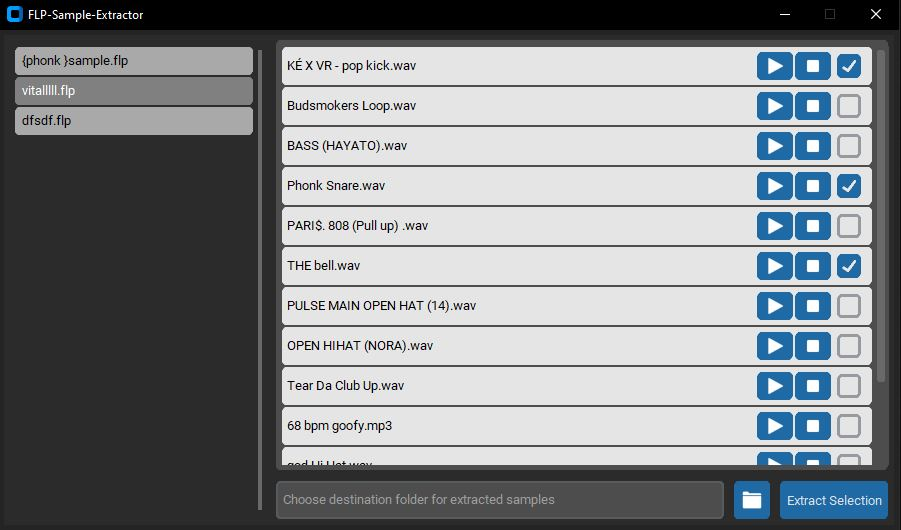

# FLP Sample Extractor 🎵

A powerful desktop tool to extract sample files used in `.flp` projects (FL Studio project files). Easily preview, filter, and export your used samples to a custom folder.

## 🚀 Features

- 🗂️ **Drag & Drop Support**: Drop individual `.flp` files, folders, or a mix of everything — the tool will recursively find all `.flp` files.
- 🎧 **Audio Preview**: Play samples directly within the app to identify them before exporting.
- ✅ **Selective Export**: Choose which samples to extract, rather than exporting everything.
- 📁 **Destination Folder Selection**: Define where you want the selected samples copied.
- 🧠 **Smart Duplicate Detection**: Already loaded projects are recognized to avoid redundant processing.


## 🚀 Releases
Ready-to-use Windows executables are available on the [Releases page](https://github.com/seideltom/flp-sample-extractor/releases).

Download the latest version and start immediately without installation.


## ⚠️ Platform Support
Currently, the project officially supports **Windows only**.

While the core code can be adapted to Unix/macOS by changing just one line, please note that on these platforms the sample detection process is significantly slower and not officially tested yet.


## 🛠 Installation

1. Clone the repository:

```bash
git clone https://github.com/seideltom/flp-sample-extractor.git
cd flp-sample-extractor
```


2. Install all required dependencies:
```bash
pip install -r requirements.txt
```
Note: You must have Python 3.10+ installed.


## ▶️ Usage

Run the application via:
```bash
python main.py
```
Then simply drag .flp files or folders containing them into the window, choose your destination folder, preview samples, and extract what you need.


## 📦 Dependencies

The project relies on the following main libraries:

- [`customtkinter`](https://github.com/TomSchimansky/CustomTkinter) – for a modern, customizable GUI (licensed under the MIT license)
- [`tkinterdnd2`](https://github.com/pmgagne/tkinterdnd2) – to enable drag-and-drop functionality (licensed under the MIT license)
- [`pygame`](https://www.pygame.org/) – for playing back audio samples inside the app (licensed under the GNU LGPL v2.1 license)
- [`Pillow`](https://python-pillow.org/) – for image handling (licensed under the MIT-CMU license)


## 🧪 Testing

Unit tests are located in the tests/ directory. You can run them with:
```bash
python -m unittest discover -s tests
```


## 📸 Screenshot
<p align="center">
  
</p>


## 💡 Why?

Organizing samples across multiple projects is a hassle. This tool makes it easy to collect all used samples into a central location, whether you're backing up your work, collaborating, or reorganizing your sample library.


## 📬 Contributing

PRs and feedback are welcome. Please open an issue first for major changes.


## 📄 License
This project is licensed under the MIT License. See the [LICENSE](./LICENSE) file for details.